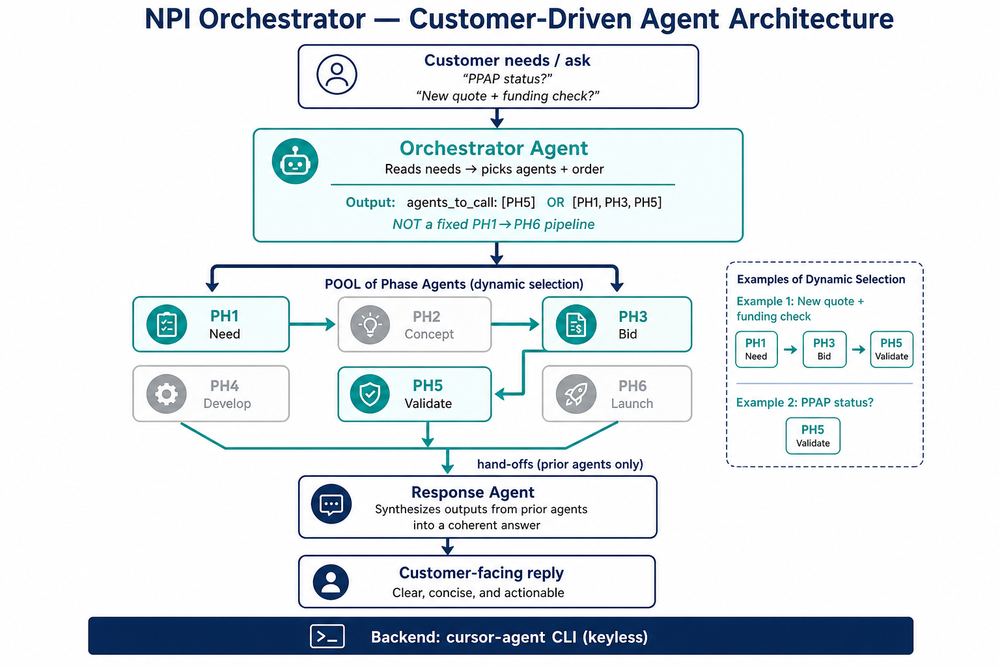
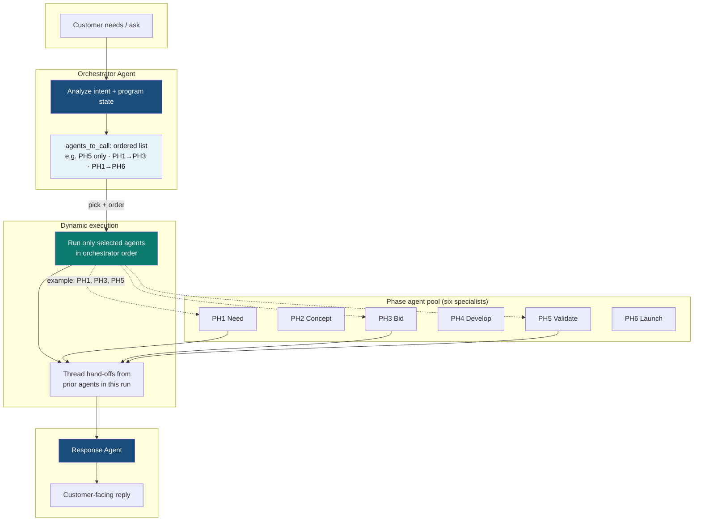

# Architecture

The NPI Orchestrator reuses the backend pattern from the workspace's other
agent tools: a thin runner that calls either the **Cursor Python SDK** or the
keyless **`cursor-agent` CLI**, with everything above it framework-specific.



## Customer-driven orchestration (not a fixed pipeline)

Earlier designs routed every ask through a **contiguous** phase range (e.g. PH3→PH6).
The current design uses an **Orchestrator agent** that reads customer needs and
returns an explicit, ordered `agents_to_call` list. Only those specialists run.



### Example routing

| Customer ask | Orchestrator calls | Skipped |
|--------------|-------------------|---------|
| "What is our PPAP status?" | **Validate** (`PH5`) | PH1–PH4, PH6 |
| "New opportunity — funding and quote readiness" | **Need → Bid** (`PH1`, `PH3`) | PH2, PH4–PH6 |
| "Full NPI review for new 48V eTurbo program" | **Need → … → Launch** (all six) | — |

**Manual mode** (sidebar / CLI) can still run a single agent or a full PH1→PH6
gate review without going through the Orchestrator agent.

## Modules

| Module | Responsibility |
|--------|----------------|
| `npi_orchestrator/runtime_env.py` | Backend resolution (auto / sdk / cli), readiness checks. No SDK import at load time. |
| `npi_orchestrator/runner.py` | `run_agent_turn(...)` - one prompt in, agent markdown out. |
| `npi_orchestrator/phases.py` | The framework: six `Phase` records (scope, gate, agent mission). |
| `npi_orchestrator/phase_agents/` | One factory module per agent: Need, Concept, Bid, Develop, Validate, Launch. |
| `npi_orchestrator/workflow.py` | `run_customer_workflow` — Orchestrator agent → phase agents → customer response. |
| `npi_orchestrator/response_synth.py` | Customer Response Agent — synthesizes the reply to the customer ask. |
| `npi_orchestrator/orchestrator_agent.py` | **Orchestrator agent** — customer needs → ordered `agents_to_call` list + brief. |
| `npi_orchestrator/customer_router.py` | Re-exports from `orchestrator_agent` (backward compatibility). |
| `npi_orchestrator/meta.py` | Parse the `NPI_META` HTML-comment JSON each agent appends (gate decision, deliverables, risks, hand-off). |
| `npi_orchestrator/agents.py` | `PhaseAgent` - builds a phase-specific system preamble and runs a turn. |
| `npi_orchestrator/orchestrator.py` | `NPIOrchestrator` - routes customer input, runs phases in order, threads hand-offs, persists JSON. |
| `npi_orchestrator/__main__.py` | CLI (`--list`, `--phase`, `--all`, `--save`). |
| `streamlit_npi.py` | Dashboard UI. |

## Data flow

1. The user supplies **customer needs** (and optionally a project brief).
2. `run_customer_workflow` calls the **Orchestrator agent** (keyless CLI by default).
   It returns an explicit ordered list such as `["PH3", "PH4", "PH5"]` — not only a
   contiguous PHx..PHy range.
3. Selected phase agents run **in that order**, each via `cursor-agent`. Hand-offs
   thread only from agents that ran earlier in the plan.
4. The Response Agent composes a **customer-facing reply** from gate decisions.
5. Optional: `plan_agent_calls()` or **Plan agent calls** in the UI to preview the
   orchestration without running gates; `run_phase(id)` for manual single-phase runs.

### Phase agent contract

Each phase agent answers with human-readable markdown **plus** a trailing
`<!--NPI_META:{...}-->` comment. `meta.split_phase_response` separates the two;
the orchestrator stores a `PhaseResult` (decision, deliverables, risks, actions,
hand-off).

### Orchestrator agent contract (`NPI_ORCH`)

```json
{
  "current_phase": "PH3",
  "project_brief": "...",
  "agents_to_call": ["PH1", "PH3", "PH5"],
  "rationale": "why these agents",
  "order_rationale": "why this sequence"
}
```

## The gate contract (`NPI_META`)

```json
{
  "phase": "PH3",
  "gate": "Bid & Value Confirmation",
  "gate_decision": "GO | GO_WITH_CONDITIONS | NO_GO | PENDING",
  "deliverables": [{"name": "...", "status": "complete|in_progress|missing", "owner": "...", "system": "..."}],
  "risks": [{"risk": "...", "severity": "high|medium|low", "mitigation": "..."}],
  "actions": ["..."],
  "handoff": "one or two sentences for the next phase"
}
```

This structured tail is what lets the orchestrator reason about the program
without re-parsing prose, and what powers the gate-status strip in the UI.

## Extending

- **Change the framework:** edit `PHASES` in `phases.py` (add/remove phases or
  edit the agent persona/mission). Everything else adapts.
- **Add a cross-phase reviewer:** add a method on `NPIOrchestrator` that feeds
  all `PhaseResult.handoff` notes into one more `run_agent_turn` call.
